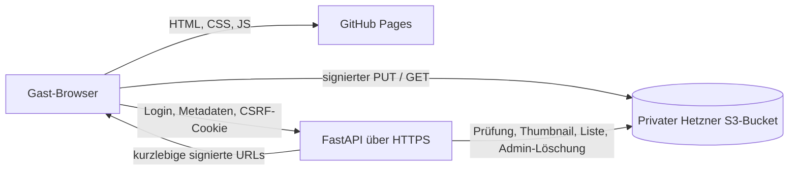

# Private Hochzeitsgalerie

Die Galerie ergänzt die statische GitHub-Pages-Einladung um einen kleinen,
separat deploybaren FastAPI-Dienst. Sie ist bewusst ohne Datenbank, Accounts,
Analytics, Queue oder Worker aufgebaut.

> Der Datenschutzhinweis in der Oberfläche und dieses Dokument sind keine
> Rechtsberatung. Verantwortliche, Löschfrist und notwendige Einwilligungen
> sollten vor Veröffentlichung rechtlich passend festgelegt werden.

## Architektur



- GitHub Pages liefert nur öffentliche, geheimnisfreie Frontend-Dateien aus.
- FastAPI prüft Passwörter, Sitzungen, CSRF-Token und Dateimetadaten und signiert
  S3-Anfragen. S3-Zugangsdaten verlassen den Server nie.
- Der Browser lädt Originale mit einem kurzlebigen, signierten `PUT` direkt zu
  S3. FastAPI lädt das begrenzte Objekt nach Abschluss einmal zur Inhaltsprüfung
  und Thumbnail-Erzeugung.
- Ein Thumbnail unter `thumbnails/<photo-id>.webp` markiert einen vollständig
  verarbeiteten Upload. Originale liegen unter `originals/<photo-id>`. Dadurch
  ist für die kleine Galerie keine Datenbank nötig.
- Die Galerie lädt nur Metadaten und WebP-Vorschaubilder. Ein Original wird erst
  beim Öffnen der Großansicht oder beim Download über eine signierte URL geladen.

## API

Alle `/api`-Antworten werden mit `Cache-Control: no-store` ausgeliefert. Schreibende
Aufrufe benötigen neben dem HttpOnly-Session-Cookie den bei Login/Status erhaltenen
`X-CSRF-Token`.

| Methode | Pfad | Berechtigung | Zweck |
| --- | --- | --- | --- |
| `POST` | `/api/auth/login` | öffentlich, limitiert | Gast anmelden |
| `GET` | `/api/auth/status` | öffentlich | Sitzung und CSRF-Token prüfen |
| `POST` | `/api/auth/logout` | Gast + CSRF | Gast abmelden |
| `GET` | `/api/config` | Gast | Upload-Limit und Löschdatum |
| `GET` | `/api/photos` | Gast | fertige Fotos seitenweise auflisten |
| `POST` | `/api/photos/upload-url` | Gast + CSRF | signierten direkten Upload anfordern |
| `POST` | `/api/photos/{id}/complete` | Gast + CSRF | Inhalt prüfen und Thumbnail erzeugen |
| `GET` | `/api/photos/{id}/download-url` | Gast | signiertes Original für Ansicht/Download |
| `POST` | `/api/photos/download` | Gast + CSRF | bis zu 100 Originale als ZIP streamen |
| `POST` | `/api/admin/auth/login` | öffentlich, separat limitiert | Admin anmelden |
| `GET` | `/api/admin/auth/status` | öffentlich | Admin-Sitzung prüfen |
| `POST` | `/api/admin/auth/logout` | Admin + CSRF | Admin abmelden |
| `GET` | `/api/admin/photos` | Admin | Fotos auflisten |
| `DELETE` | `/api/admin/photos/selection` | Admin + CSRF | bis zu 100 Fotos gemeinsam löschen |
| `DELETE` | `/api/admin/photos/{id}` | Admin + CSRF | Original und Thumbnail löschen |
| `DELETE` | `/api/admin/photos` | Admin + CSRF | Galerie nach Bestätigung vollständig löschen |

Die interaktive API-Dokumentation ist nur außerhalb von `production` unter
`/docs` aktiv.

## Lokal entwickeln

Voraussetzungen: Python 3.12 oder neuer, Node.js für die statischen Checks und
ein S3-kompatibler Test-Bucket. Die API greift bei Upload/Listing auf den in der
lokalen `.env` eingetragenen Bucket zu; die automatisierten Tests benötigen
keinen echten Bucket.

```powershell
cd backend
python -m venv .venv
.\.venv\Scripts\Activate.ps1
python -m pip install -e ".[test]"
Copy-Item .env.example .env
python tools/hash_password.py
uvicorn app.main:app --reload --host 127.0.0.1 --port 8080 --no-access-log
```

Die beiden erzeugten Argon2-Hashes und ein zufälliges Session-Geheimnis in
`backend/.env` eintragen. Für lokal außerdem setzen:

```dotenv
APP_ENVIRONMENT=development
FRONTEND_ORIGIN=http://localhost:8000
COOKIE_SECURE=false
COOKIE_SAMESITE=lax
```

In einem zweiten Terminal im Projektstamm:

```powershell
python frontend/tools/serve.py
```

Galerie: <http://localhost:8000/fotos/>. Der lokale Origin muss während der
Entwicklung zusätzlich in der Bucket-CORS-Regel stehen; danach wieder entfernen.

Tests und Checks:

```powershell
cd backend
python -m pytest
python -m ruff check app tests tools
cd ..
powershell -ExecutionPolicy Bypass -File frontend/tools/check.ps1
```

## Umgebungsvariablen

Alle geheimen Werte gehören ausschließlich in die Runtime-Umgebung des Backends.
`backend/.env` ist ignoriert und darf nicht committed oder in das Pages-Frontend
kopiert werden.

| Variable | Bedeutung |
| --- | --- |
| `APP_ENVIRONMENT` | `production`, `development` oder `test` |
| `FRONTEND_ORIGIN` | exakter Origin der Pages-Seite, ohne abschließenden Slash |
| `S3_ENDPOINT_URL` | z. B. `https://nbg1.your-objectstorage.com` |
| `S3_ACCESS_KEY_ID` / `S3_SECRET_ACCESS_KEY` | nur serverseitige Runtime-Zugangsdaten |
| `S3_BUCKET` | privater Bucketname |
| `S3_REGION` | `nbg1` oder `fsn1` für Deutschland |
| `S3_ADDRESSING_STYLE` | für Hetzner normalerweise `virtual` |
| `WEDDING_GUEST_PASSWORD_HASH` | Argon2-Hash des gemeinsamen Gastpassworts |
| `WEDDING_ADMIN_PASSWORD_HASH` | anderer Argon2-Hash für das Paar |
| `SESSION_SECRET` | mindestens 32 zufällige Zeichen, besser 48+ Bytes |
| `SESSION_TTL_SECONDS` | Sitzungsdauer, Standard 24 Stunden |
| `COOKIE_SECURE` | in Produktion zwingend `true` |
| `COOKIE_SAMESITE` | siehe Cookie-Abschnitt unten |
| `SIGNED_URL_TTL_SECONDS` | Gültigkeit signierter URLs, Standard 10 Minuten |
| `MAX_UPLOAD_SIZE` | maximales Original in Bytes, Standard 25 MiB |
| `MAX_IMAGE_PIXELS` | Schutz gegen Dekompressionsbomben |
| `THUMBNAIL_MAX_DIMENSION` | längste Thumbnail-Kante in Pixeln |
| `GALLERY_PAGE_SIZE` | Fotos pro Listenantwort, Standard 50 |
| `LOGIN_MAX_FAILURES` / `LOGIN_WINDOW_SECONDS` | In-Memory-Loginlimit |
| `RETENTION_UNTIL` | sichtbares, dokumentiertes Löschdatum (`YYYY-MM-DD`) |

Das Passwort wird nie an den Browser ausgeliefert. Wird ein Passwort-Hash in der
Umgebung geändert und die API neu gestartet, werden alle Sitzungen dieser Rolle
automatisch ungültig. Eine Änderung von `SESSION_SECRET` invalidiert Gast- und
Admin-Sitzungen gleichzeitig.

## Hetzner Object Storage exakt einrichten

Hetzner Object Storage ist unter anderem in Nürnberg (`nbg1`) und Falkenstein
(`fsn1`) verfügbar. Für deutsche Speicherung einen dieser Standorte wählen.

1. In der Hetzner Console ein dediziertes Projekt für den Galerie-Bucket anlegen.
2. Unter **Object Storage** einen Bucket in `nbg1` oder `fsn1` erstellen.
3. Sichtbarkeit ausdrücklich auf **private** belassen. Kein Object Lock aktivieren,
   wenn die Galerie zum Stichtag sicher vollständig löschbar sein soll.
4. Ein Bootstrap-S3-Schlüsselpaar im Bucket-Projekt erzeugen, sicher offline
   speichern und nur für Bucket-Konfiguration verwenden.
5. Empfohlen für echte Minimalrechte: ein zweites leeres Hetzner-Projekt nur für
   das Runtime-Schlüsselpaar anlegen. Dessen Projekt-ID und Access Key werden im
   Bucket-Policy-Principal verwendet. Das Secret sofort sicher speichern; es ist
   später nicht erneut in der Console sichtbar.
6. Mit den Bootstrap-Zugangsdaten und AWS CLI/S3cmd die folgende CORS-Regel,
   Bucket-Policy und optional die Lifecycle-Regel anwenden.
7. Ausschließlich das Runtime-Schlüsselpaar als Backend-Environment setzen. Die
   Bootstrap-Zugangsdaten niemals in den Container oder das Repository legen.

### CORS für direkte Browser-Uploads

`infrastructure/hetzner/bucket-cors.json` (Origin ersetzen; keine Wildcard
verwenden):

```json
{
  "CORSRules": [
    {
      "AllowedOrigins": ["https://wedding.example.com"],
      "AllowedHeaders": [
        "content-type",
        "x-amz-meta-photo-id",
        "x-amz-meta-original-name"
      ],
      "AllowedMethods": ["GET", "HEAD", "PUT"],
      "ExposeHeaders": ["ETag"],
      "MaxAgeSeconds": 600
    }
  ]
}
```

```bash
aws --endpoint-url https://nbg1.your-objectstorage.com \
  s3api put-bucket-cors \
  --bucket YOUR_PRIVATE_BUCKET \
  --cors-configuration file://infrastructure/hetzner/bucket-cors.json
```

Die API-CORS-Konfiguration (`FRONTEND_ORIGIN`) und Bucket-CORS sind getrennt:
Erstere schützt Session/API-Aufrufe, letztere erlaubt dem Browser den signierten
Direktupload.

### Minimale Runtime-Rechte

Das Backend benötigt nur:

- `s3:ListBucket` auf den Bucket;
- `s3:GetObject`, `s3:PutObject` und `s3:DeleteObject` auf dessen Objekte.

`bucket-policy.json` (Runtime-Projekt-ID, Access Key und Bucket ersetzen):

```json
{
  "Version": "2012-10-17",
  "Statement": [
    {
      "Sid": "ListWeddingGallery",
      "Effect": "Allow",
      "Principal": {
        "AWS": "arn:aws:iam:::user/pRUNTIME_PROJECT_ID:RUNTIME_ACCESS_KEY"
      },
      "Action": ["s3:ListBucket"],
      "Resource": ["arn:aws:s3:::YOUR_PRIVATE_BUCKET"]
    },
    {
      "Sid": "ManageWeddingPhotos",
      "Effect": "Allow",
      "Principal": {
        "AWS": "arn:aws:iam:::user/pRUNTIME_PROJECT_ID:RUNTIME_ACCESS_KEY"
      },
      "Action": ["s3:GetObject", "s3:PutObject", "s3:DeleteObject"],
      "Resource": ["arn:aws:s3:::YOUR_PRIVATE_BUCKET/*"]
    }
  ]
}
```

```bash
aws --endpoint-url https://nbg1.your-objectstorage.com \
  s3api put-bucket-policy \
  --bucket YOUR_PRIVATE_BUCKET \
  --policy file://bucket-policy.json
```

Hetzner-Schlüssel gelten standardmäßig projektweit. Die Trennung in ein leeres
Runtime-Projekt verhindert, dass der API-Key andere Buckets des Bucket-Projekts
erreicht. Wer die Zwei-Projekt-Variante nicht nutzt, sollte zumindest ein eigenes
Projekt verwenden, das ausschließlich diesen einen Bucket enthält.

### Löschfrist/Lifecycle

`RETENTION_UNTIL` dokumentiert den Stichtag in UI und API, löscht aber bewusst
nicht selbständig. Für technische Durchsetzung zusätzlich eine Bucket-Lifecycle-
Regel setzen. Beispiel ohne Bucket-Versionierung:

```json
{
  "Rules": [
    {
      "ID": "delete-wedding-gallery",
      "Status": "Enabled",
      "Prefix": "",
      "Expiration": { "Date": "2027-03-31T23:59:00Z" },
      "AbortIncompleteMultipartUpload": { "DaysAfterInitiation": 1 }
    }
  ]
}
```

```bash
aws --endpoint-url https://nbg1.your-objectstorage.com \
  s3api put-bucket-lifecycle-configuration \
  --bucket YOUR_PRIVATE_BUCKET \
  --lifecycle-configuration file://lifecycle.json
```

Datum in `.env`, Oberfläche, interner Datenschutzdokumentation und Lifecycle
identisch halten. Versionierung ist standardmäßig nicht erforderlich; sie würde
gelöschte Versionen weiter speichern und braucht zusätzliche Lifecycle-Regeln.

Offizielle Referenzen:

- [Hetzner Object Storage – Endpunkte und Standorte](https://docs.hetzner.com/storage/object-storage/overview/)
- [Hetzner – Bucket-CORS konfigurieren](https://docs.hetzner.com/storage/object-storage/howto-protect-objects/cors/)
- [Hetzner – S3-Zugangsdaten und Bucket-Rechte einschränken](https://docs.hetzner.com/storage/object-storage/faq/s3-credentials/)
- [Hetzner – Lifecycle-Regeln](https://docs.hetzner.com/storage/object-storage/howto-protect-objects/manage-lifecycle/)

## Backend deployen

1. Docker-Image im `backend`-Verzeichnis bauen:

   ```bash
   docker build -t wedding-gallery-api:1.0 .
   ```

2. Einen kleinen Containerdienst oder Server in Deutschland/EU auswählen und
   alle Werte aus `.env.example` als geheime Runtime-Variablen setzen. Keine
   `.env` in das Image kopieren.
3. Container intern auf Port `8080` starten. Der enthaltene Prozess läuft als
   unprivilegierter Benutzer und deaktiviert Uvicorn-Access-Logs.
4. `photos-api.example.com` per DNS auf den Dienst zeigen lassen und ein gültiges
   TLS-Zertifikat einrichten. HTTP dauerhaft auf HTTPS umleiten.
5. Der Reverse Proxy sollte keine Request-/Response-Bodies, Cookies oder Header
   protokollieren. Normale Fehlerlogs ohne personenbezogene Inhalte reichen aus.
6. Healthcheck auf `GET /healthz` konfigurieren; er prüft absichtlich nicht den
   Bucket und gibt nur `{"status":"ok"}` aus.
7. Hinter einem vertrauenswürdigen Proxy Uvicorn mit
   `--proxy-headers --forwarded-allow-ips=<PROXY-IP>` starten, damit das Loginlimit
   die echte Client-IP sieht. Nie pauschal fremde Forwarded-Header vertrauen.
8. Für diese kleine Galerie einen API-Prozess verwenden. Der In-Memory-Limiter
   wird pro Prozess geführt und beim Neustart zurückgesetzt.

### Cookie- und Origin-Wahl

- Bevorzugt: Frontend und API unter derselben registrierbaren Domain, z. B.
  `wedding.example.com` und `photos-api.example.com`. Dann
  `COOKIE_SAMESITE=lax`, `COOKIE_SECURE=true` und exakten HTTPS-Origin setzen.
- Wenn GitHub-`github.io` und API wirklich cross-site sind, ist
  `COOKIE_SAMESITE=none` zusammen mit `COOKIE_SECURE=true` nötig. Die zusätzliche
  CSRF-Prüfung bleibt aktiv.
- Cookies sind host-only, HttpOnly und auf `/api` begrenzt. Das Frontend speichert
  weder Passwort noch Session in `localStorage`.

## GitHub Pages konfigurieren

1. In `frontend/gallery.config.js` ausschließlich `apiBaseUrl` auf den
   HTTPS-Origin der API setzen, z. B. `https://photos-api.example.com`. Das ist
   öffentliche Konfiguration und kein Geheimnis.
2. Denselben Pages-Origin (Schema + Host, kein Pfad/Slash) als
   `FRONTEND_ORIGIN` im Backend und als einzigen Produktions-Origin in Bucket-CORS
   eintragen.
3. Änderungen unter `frontend/` committen und pushen. Der Workflow
   `.github/workflows/deploy-pages.yml` prüft die statischen Dateien und lädt
   ausschließlich `frontend/` als Pages-Artefakt hoch; es gibt keinen
   Build-Schritt.
4. Unter GitHub **Settings → Pages** als Quelle **GitHub Actions** auswählen und
   anschließend **Enforce HTTPS** prüfen. Die Galerie liegt unter `/fotos/` und
   ist aus der Einladung verlinkt.
5. Im Browser Login, Mehrfachupload (inklusive iPhone/Android), Thumbnail,
   Großansicht, Einzel- und ZIP-Download sowie Logout prüfen. Unter
   `/fotos/admin/` zusätzlich Admin-Login, Auswahl und Mehrfachlöschung testen.
   In den DevTools darf keine Anfrage S3-Schlüssel enthalten; sichtbar sind nur
   kurzlebige signierte URLs.

## Admin-Verwendung und vollständige Löschung

Die geschützte Admin-Ansicht liegt unter `/fotos/admin/`. Nach Anmeldung mit dem
Admin-Passwort können sichtbare Fotos einzeln oder gemeinsam ausgewählt und nach
einer Sicherheitsabfrage dauerhaft gelöscht werden.

Alternativ mit einem API-Client:

1. `POST /api/admin/auth/login` mit `{"password":"..."}` senden und Cookie-Jar
   behalten.
2. `csrf_token` aus der Antwort bei schreibenden Aufrufen als
   `X-CSRF-Token` senden.
3. Einzelnes Foto mit `DELETE /api/admin/photos/{id}` oder mehrere mit
   `DELETE /api/admin/photos/selection` und Body `{"photo_ids":["..."]}` löschen.
4. Ganze Galerie mit `DELETE /api/admin/photos` und Body
   `{"confirmation":"ALLE_FOTOS_ENDGUELTIG_LOESCHEN"}` löschen.
5. Danach per S3-CLI prüfen, dass `originals/` und `thumbnails/` leer sind, und
   bei endgültiger Stilllegung Bucket, Runtime-Zugangsdaten, API-Secrets, DNS und
   Backenddienst entfernen. Ein optionales Backup vorher verschlüsselt und mit
   eigener Löschfrist lokal ablegen.

Der Admin-Endpunkt entfernt fertige Originale und Thumbnails. Abgebrochene
Direktuploads können unsichtbare Originale ohne Thumbnail hinterlassen; die
Voll-Löschung entfernt auch diese. Die Lifecycle-Regel ist die zusätzliche
technische Rückfallebene.

## Sicherheits- und Datenschutzentscheidungen

- Private Bucket-Sichtbarkeit und kurzlebige SigV4-URLs; keine dauerhaften
  Objekt-URLs.
- Separate Argon2-Passwörter für Gast und Admin, signierte kurzlebige Sessions,
  HttpOnly/Secure-Cookies, exakte CORS-Allowlist und CSRF-Token.
- Serverseitig erzeugte, streng validierte IDs; Gastdateinamen werden nie als
  Objektpfad verwendet. Dateiendung, MIME, tatsächliches Bildformat, Dateigröße
  und maximale Pixelzahl werden geprüft.
- JPEG, PNG, WebP und HEIC/HEIF werden unterstützt. Thumbnail-Erzeugung richtet
  die EXIF-Orientierung aus und schreibt neues WebP ohne EXIF/GPS-Metadaten.
- Originale bleiben unverändert und können EXIF/GPS-Daten enthalten. Das wird in
  der Oberfläche ausdrücklich erklärt.
- Keine Nutzerkonten, Namen, E-Mail-Adressen, Analyse-Skripte oder Tracker. Das
  Backend-Image deaktiviert Access-Logs; Betreiber sollten Proxy-/Plattformlogs
  ebenfalls minimieren.
- Verarbeitet/gespeichert werden: statische Dateien bei GitHub Pages; kurzlebige
  Session-/CSRF-Daten im Browser/API; Bilder und technische Objektmetadaten bei
  Hetzner; flüchtige IP-basierte Fehlversuchszähler im API-Prozess.

## Bewusste Grenzen

- Kein ZIP-/Mehrfachdownload: serverseitiges Packen würde Originale durch die API
  leiten und mehr CPU, Bandbreite sowie temporären Speicher benötigen. Einzelne
  Originaldownloads bleiben einfach und direkt.
- Der S3-Präfix ist zugleich der Katalog. Das passt für eine Hochzeitsgalerie,
  ersetzt aber keine große Mediendatenbank oder komplexe Suche.
- Thumbnail-Erzeugung erfolgt synchron beim Abschluss. Bei 25-MiB-Limit ist das
  einfach und zuverlässig; bei deutlich größeren Dateien wäre ein Worker sinnvoll.
- Der Login-Limiter ist absichtlich In-Memory und für einen Prozess gedacht. Bei
  horizontaler Skalierung wäre ein gemeinsamer Limiter nötig.
- Text und Technik unterstützen Privacy by Design, ersetzen aber keine Prüfung
  der konkreten Informations-/Einwilligungspflichten.
